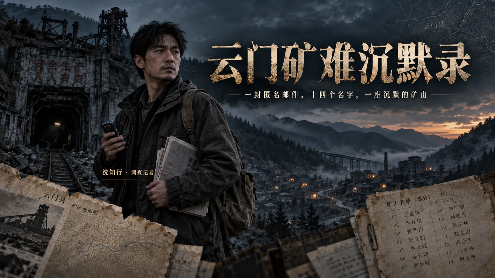

# 云门矿难沉默录

一款以调查记者工作为核心的浏览器 ARG / 叙事解谜游戏。

玩家将扮演《方圆周刊》记者沈知行，从一封凌晨收到的匿名邮件开始，查阅残缺名单、搜索地方新闻、走访矿工家属、比对判决书与企业工商记录，逐步拼出恒源铁矿多年事故瞒报背后的真相。



> 一封匿名邮件，十四个名字，以及一座习惯沉默的矿山。

## 游戏特色

- **仿真调查桌面**：邮箱、搜索引擎、地方新闻门户、地图、通讯录与证据夹共同构成调查界面。
- **信息拼接解谜**：关键词藏在邮件、新闻评论、人物口述、照片和文件细节中，需要玩家自行交叉核对。
- **递进式实地走访**：沿驾车路线逐站进入江源县乡镇，与村口 NPC 和矿工家属对话，逐步解锁下一处地点。
- **视觉小说式对话**：写实场景作为背景，人物立绘位于前景，台词逐句推进。
- **新闻调查流程**：不仅要找到线索，还要核实信源、识别立场、联系涉事企业并给予回应机会。
- **本地进度保存**：游戏会自动保存调查进度，也可通过左上角按钮重新开始。
- **横竖屏适配**：支持桌面浏览器与手机竖屏体验。

## 开始游戏

项目是纯静态网页，不需要安装依赖或执行构建。

```bash
cd yunmen-game
python3 -m http.server 8765 --bind 127.0.0.1
```

然后在浏览器中打开：

```text
http://127.0.0.1:8765/
```

推荐使用较新版本的 Chrome、Edge 或 Safari，并开启声音以外的普通网页权限即可。游戏不需要联网，也不会向服务器上传调查进度。

## 基本玩法

1. 从邮箱中的匿名邮件和附件开始调查。
2. 把文件、新闻与评论中出现的地点或身份信息作为搜索关键词。
3. 在地图中进入已经解锁的地区，按路线走访相关人物。
4. 将不同来源的说法放在一起核对，观察年份、人数、地名和事故细节是否吻合。
5. 定期查看证据夹中的记者笔记，确认当前推论和下一步行动。

遇到卡关时可查看 [完整流程攻略](WALKTHROUGH.md)。该文件包含严重剧透，建议完成游戏后再阅读。

## 项目结构

```text
yunmen-game/
├── index.html       # 页面结构与各类应用窗口
├── style.css        # 桌面、地图、新闻、邮件及移动端样式
├── script.js        # 剧情状态、解谜条件与交互逻辑
├── assets/          # WebP 场景、人物和新闻配图
└── WALKTHROUGH.md   # 完整流程与谜题答案（含剧透）
```

## 内容提示

本作涉及矿难、死亡、事故瞒报、家属赔偿及地方权力关系等沉重内容，请根据自身情况体验。

## 虚构声明与创作说明

游戏中的云门县、江源县、恒源铁矿、人物姓名、机构名称及具体案件均为虚构改编，如有雷同，纯属巧合。

作品原型取材自《中国新闻周刊》记者刘向南于 2023 年发表的调查报道《山西代县矿工死亡瞒报事件调查》，旨在致敬持续核实事实、记录沉默者姓名的调查记者。游戏中的写实场景和人物配图由生成式图像工具辅助创作，仅用于虚构叙事。

## 许可

本项目暂未设置开源许可证。未经作者明确许可，请勿将代码、文本或图片素材用于再发布或商业用途。
